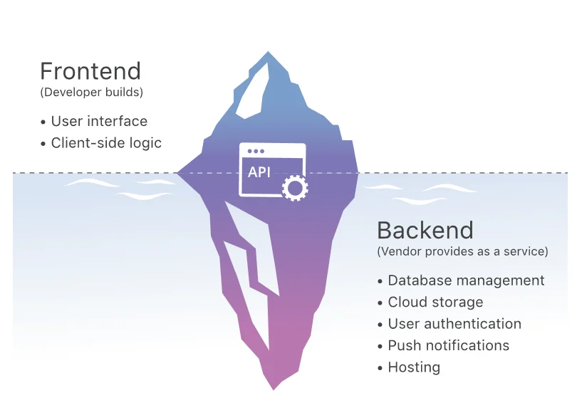

 

# ***Building a Backend-as-a-Service (BaaS) system from scratch***

# ​​**1. ​What is Backend as a Service (BaaS)?**

*`BaaS`* là ​​một nền tảng đám mây cung cấp cơ sở hạ tầng và các dịch vụ `backend` được xây dựng sẵn. Nó giúp các nhà phát triển không còn phải lo việc quản lý máy chủ, cơ sở dữ liệu và các tác vụ `backend` khác.

 

# **2. Tại sao phải xây dựng hệ thống BaaS?**

Như đã nói ở trên, BaaS là dịch vụ giúp các nhà phát triển giảm bớt gắng nặng về hạ tầng cũng như thời gian phát triển ứng dụng của họ. Tuy nhiên, những tiện lợi mà BaaS đã cung cấp lại là một sự phụ thuộc không hề nhẹ với bên nhà cung cấp. Vì thế cần xây dựng một hệ thống BaaS nhẹ, tối ưu, không phụ thuộc bên thứ 3 (tránh dependency hell, lỗ hổng bảo mật từ thư viện ngoài) và duy trì sự kiểm soát 100% đối với mã nguồn.

# **3. Hệ thống BaaS sẽ có những yêu cầu gì?**

## 3.1 Yêu cầu Chức năng (Functional Requirements - FR)

1. Tự động hóa REST API & CRUD (Auto-generated APIs):
    - **Ánh xạ động:** Tự động chuyển đổi các bảng/bộ sưu tập (collections) dữ liệu thành các điểm cuối (endpoints) RESTful (như `GET`, `POST`, `PUT`, `DELETE`) mà không cần viết mã thủ công cho từng thực thể.
    - **Truy vấn &amp; Lọc động:** Hỗ trợ phân tích tham số URL để thực hiện lọc dữ liệu (ví dụ: các toán tử `eq.`, `gt.`), sắp xếp, phân trang (pagination) và chọn lọc trường trả về.
2. Quản lý Schema & Động cơ Di cư Tự động (Auto-Migration Engine):
    - **Quản lý bộ sưu tập (Collections):** Cho phép người dùng định nghĩa cấu trúc dữ liệu và kiểu trường thông qua giao diện đồ họa (Admin UI) hoặc định nghĩa JSON.
    - **So sánh trạng thái Schema (Schema Diffing):** Tự động đối chiếu giữa định nghĩa JSON mới và schema thực tế trong cơ sở dữ liệu (qua `sqlite_master` hoặc `information_schema`) khi khởi động hoặc cập nhật.
    - **Tạo &amp; thực thi di cư:** Tự động sinh ra các tệp di cư (migration files/scripts) chứa lệnh SQL (`CREATE TABLE`, `ALTER TABLE`) và áp dụng tuần tự trong giao dịch (transaction).
3. Bộ Quản lý Xác thực (Authentication Engine):
    - **Mã hóa thông tin đăng nhập:** Băm mật khẩu người dùng bằng giải thuật mở rộng khóa **PBKDF2**.
    - **Cấp phát &amp; Quản lý Token:** Sinh và xác thực chuỗi **JSON Web Token (JWT)** phi trạng thái ký đối xứng bằng HS256 để quản lý phiên làm việc.
    - **Đa dạng phương thức Auth:** Hỗ trợ đăng nhập qua Email/Mật khẩu, OAuth2 (Google, GitHub...), OTP và Magic Links.
4. Phân quyền & Kiểm soát Truy cập (Authorization & Access Control):
    - Thiết lập các quy tắc phân quyền linh hoạt ở cấp độ bộ sưu tập (API Rules) hoặc cơ chế bảo mật hàng (Row-Level Security - RLS) để đảm bảo người dùng chỉ có thể truy cập/thao tác trên dữ liệu được phép.
5. Động cơ Thời gian thực (Realtime Sync Engine):
    - **Server-Sent Events (SSE):** Cung cấp luồng truyền dữ liệu một chiều từ máy chủ về máy khách qua HTTP dạng `text/event-stream` nhẹ nhàng cho các cập nhật dữ liệu liên tục.
    - **WebSockets thô (RFC 6455):** Hỗ trợ giao tiếp hai chiều toàn song công (Full-Duplex) với quy trình bắt tay chuyển đổi giao thức HTTP 101, giải mã khung nhị phân và xử lý mặt nạ XOR.
6. Quản lý Lưu trữ Tệp tin (File Storage Management):
    - `Hỗ trợ tải tệp` lên/tải về, đính kèm tệp vào bản ghi dữ liệu, tự động tạo ảnh thu nhỏ (thumbnails) và quản lý quyền truy cập tệp.
    - `Hỗ trợ lưu trữ` trên đĩa cục bộ hoặc tương thích với chuẩn AWS S3 API.
7. Khả năng Mở rộng Mã Tùy chỉnh (Custom Code Extensibility):
    - Cho phép nhà phát triển mở rộng logic nghiệp vụ bằng cách đăng ký các điểm cuối HTTP tùy chỉnh (custom routes), cắm móc sự kiện (request hooks) và thiết lập lịch chạy tự động (cron jobs) thông qua môi trường thực thi.

## 3.2 Yêu cầu Phi chức năng (Non-Functional Requirements - NFR)

1. Bảo mật & An toàn Dữ liệu (Security).
2. Hiệu năng & Xử lý Đồng thời (Performance & Concurrency).
3. Kiến trúc Hạ tầng & Triển khai (Infrastructure & Deployment).
4. Khả năng Bảo trì & Sao lưu (Maintainability & Disaster Recovery).